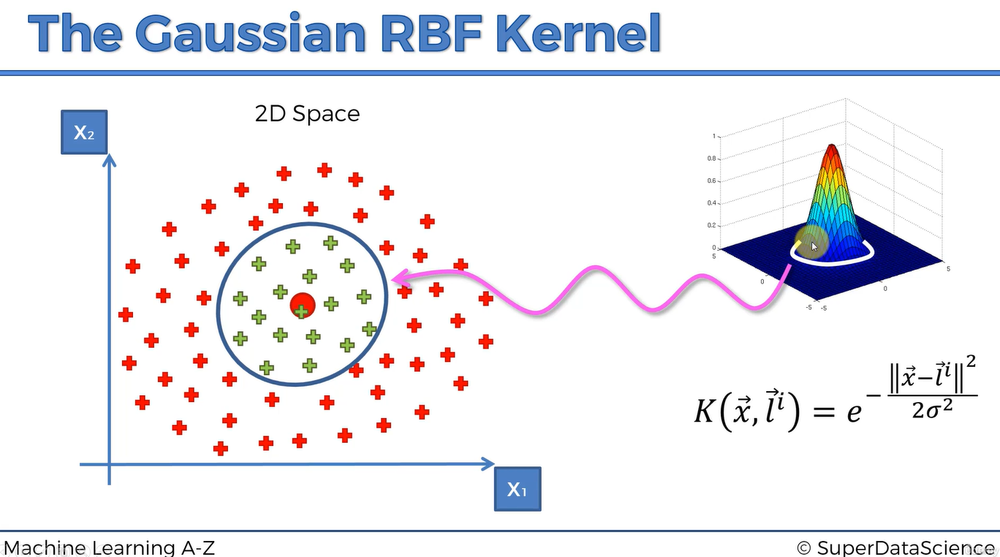
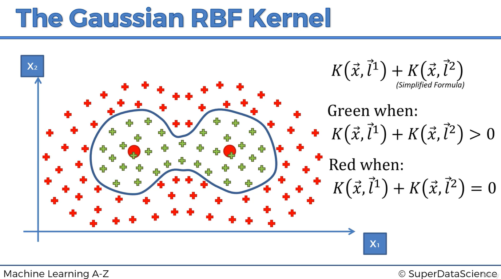

# The Kernel Trick and the Gaussian RBF Kernel

We have seen that a feature mapping can make a non-linear classification problem linear in a higher-dimensional space. Explicitly constructing that feature space, however, may require a great deal of computation.

The **kernel trick** allows an SVM to use inner products from an implicit feature space without calculating every transformed coordinate. One of the most widely used kernels for this purpose is the **Gaussian Radial Basis Function (RBF) kernel**.

The terms *Gaussian kernel* and *RBF kernel* usually refer to the same function in the SVM context.

## The Gaussian RBF Kernel

One common form of the RBF kernel is:

\[
K(x,\ell_i)
=
\exp\left(
-\frac{\lVert x-\ell_i\rVert^2}{2\sigma^2}
\right),
\]

where:

- \(K\) is the kernel function;
- \(x\) is the observation being evaluated;
- \(\ell_i\) is a reference observation, described intuitively as a **landmark**;
- \(\lVert x-\ell_i\rVert\) is the Euclidean distance between them; and
- \(\sigma\) controls the width of the region of influence.

The notation \(\lVert x-\ell_i\rVert^2\) means the squared Euclidean distance:

\[
\lVert x-\ell_i\rVert^2
=
\sum_{j=1}^{d}(x_j-\ell_{ij})^2.
\]

In most software libraries, the RBF kernel is written using \(\gamma\):

\[
K(x,z)=\exp\left(-\gamma\lVert x-z\rVert^2\right),
\]

with:

\[
\gamma=\frac{1}{2\sigma^2}.
\]

Thus, \(\sigma\) and \(\gamma\) describe the same width relationship in opposite directions.

## Understanding the RBF Surface

The RBF kernel can be visualized as a bell-shaped surface centered on the landmark.

The horizontal axes represent the original features, such as \(x_1\) and \(x_2\). The vertical axis represents the kernel value \(K(x,\ell_i)\).

### At the Landmark

When \(x=\ell_i\), the distance is zero:

\[
\lVert x-\ell_i\rVert^2=0.
\]

Therefore:

\[
K(x,\ell_i)
=
e^0
=
1.
\]

The maximum kernel value occurs at the landmark.

### Close to the Landmark

When \(x\) is close to \(\ell_i\), the squared distance is small. The exponent is then a small negative number, so the kernel value remains close to \(1\).

For example:

\[
e^{-0.1}\approx0.905.
\]

Nearby observations are therefore treated as highly similar.

### Far from the Landmark

When \(x\) is far from \(\ell_i\), the squared distance becomes large. The exponent becomes strongly negative, making the kernel value approach zero:

\[
\lim_{\lVert x-\ell_i\rVert\rightarrow\infty}
K(x,\ell_i)=0.
\]

For every finite distance, however, the RBF value is strictly positive:

\[
0<K(x,\ell_i)\leq1.
\]

The diagram's outer region should therefore be understood as having values **very close to zero**, not exactly zero.

## The Role of \(\sigma\) and \(\gamma\)

The parameter \(\sigma\) controls the width of the Gaussian bell:

- a **large \(\sigma\)** creates a wide bell and gives the landmark a broad region of influence;
- a **small \(\sigma\)** creates a narrow bell and gives the landmark a local region of influence.

Because \(\gamma=1/(2\sigma^2)\), the interpretation of \(\gamma\) is reversed:

- a **small \(\gamma\)** creates a wide, smooth region of influence;
- a **large \(\gamma\)** creates a narrow, highly local region of influence.

An excessively large \(\gamma\) can produce a complicated boundary that overfits the training data. An excessively small \(\gamma\) can produce an overly smooth boundary that underfits.

## From Kernel Similarity to Classification

The landmark illustration provides useful geometric intuition, but a standard RBF SVM does not usually choose one arbitrary center and classify observations using the rule “positive kernel value means one class.”

That rule would not work because every RBF value is positive.

Instead, the trained SVM combines kernel evaluations using learned coefficients:

\[
f(x)
=
\sum_{i\in SV}
\alpha_i y_i K(x_i,x)+b,
\]

where:

- \(SV\) is the set of support vectors;
- \(x_i\) is a support vector;
- \(y_i\in\{-1,+1\}\) is its class label;
- \(\alpha_i\) is a learned non-negative coefficient;
- \(K(x_i,x)\) measures similarity between \(x\) and the support vector; and
- \(b\) is the learned bias or intercept.

The predicted class is determined by the sign of the complete decision score:

\[
\hat{y}=
\begin{cases}
+1, & f(x)\geq0,\\
-1, & f(x)<0.
\end{cases}
\]

The decision boundary is the set of points for which:

\[
f(x)=0.
\]

Individual RBF values do not have to equal zero for the combined score to cross zero. Positive and negative class contributions, their learned weights, and the bias balance one another to form the boundary.

## Combining Several Local Influences

Several RBF functions centered on different support vectors can create a complex non-linear decision boundary.

This diagram communicates the intuition that multiple local regions can combine to enclose observations with an irregular boundary. Its displayed formula is deliberately simplified.

The actual decision function is not normally an unweighted sum such as:

\[
K(x,\ell_1)+K(x,\ell_2).
\]

Because both terms are positive, that sum cannot be negative and is not exactly zero at any finite point. A usable SVM decision function requires signed, weighted contributions and a bias:

\[
f(x)
=
\sum_{i\in SV}
\alpha_i y_iK(x_i,x)+b.
\]

Support vectors from the positive class contribute in one direction, while support vectors from the negative class contribute in the other. Their combined influence can create separate regions, curved contours, and highly flexible boundaries.

## Where the “Landmarks” Come From

The landmark terminology is a helpful way to introduce Gaussian features. In a standard Kernel SVM:

- kernel evaluations are initially associated with training observations;
- the optimization process determines the coefficients \(\alpha_i\); and
- observations with \(\alpha_i>0\) become support vectors.

Consequently, the support vectors act like the relevant RBF centers in the final classifier. Their locations are not normally optimized as separate free parameters.

Only the support vectors appear in the final decision function, so training observations with \(\alpha_i=0\) do not contribute directly to predictions.

## Why This Is the Kernel Trick

An SVM can be expressed in terms of dot products between observations. If \(\phi(x)\) represents an explicit feature mapping, the required transformed-space dot product is:

\[
\phi(x_i)^T\phi(x_j).
\]

A valid kernel computes the same quantity directly:

\[
K(x_i,x_j)
=
\phi(x_i)^T\phi(x_j).
\]

The model can therefore behave as though it were operating in a potentially enormous feature space without explicitly constructing the transformed vectors.

For the RBF kernel, that implicit feature space is infinite-dimensional. The algorithm still evaluates the kernel using the observations' original coordinates, but the result corresponds to an inner product in the implicit feature space.

The kernel trick does not mean that the higher-dimensional mathematical representation disappears. It means that the representation does not need to be explicitly computed.

## The Complete RBF SVM Picture

The process can be summarized as follows:

1. Scale the original features.
2. Evaluate RBF similarities between training observations.
3. Solve the SVM optimization problem to identify support vectors and their coefficients.
4. For a new observation, evaluate its kernel similarity to each support vector.
5. Combine those similarities with the learned coefficients, class signs, and bias.
6. Use the sign of the decision score to predict the class.

This procedure creates a non-linear decision boundary in the original input space while retaining the maximum-margin principle in the implicit feature space.

---

# Study Notes

## Key Terms

| Term | Meaning |
|---|---|
| **RBF kernel** | A Gaussian similarity function based on squared Euclidean distance. |
| **Landmark** | An intuitive name for the center against which an RBF feature is evaluated. |
| **Support vector** | A training observation with a nonzero learned coefficient that contributes to the final SVM decision function. |
| **Kernel value** | A similarity value corresponding to an inner product in an implicit feature space. |
| **\(\sigma\)** | Controls the width of the Gaussian; larger values produce wider influence. |
| **\(\gamma\)** | The inverse-width parameter commonly used by software; larger values produce narrower influence. |
| **Decision score** | The weighted kernel sum plus bias, \(f(x)\). |
| **Decision boundary** | The set of observations satisfying \(f(x)=0\). |
| **Kernel trick** | Computing feature-space inner products without explicitly constructing the feature-space coordinates. |

## Essential Formulas

### RBF Kernel Using \(\sigma\)

\[
K(x,z)
=
\exp\left(
-\frac{\lVert x-z\rVert^2}{2\sigma^2}
\right).
\]

### RBF Kernel Using \(\gamma\)

\[
K(x,z)
=
\exp\left(
-\gamma\lVert x-z\rVert^2
\right).
\]

### Parameter Relationship

\[
\gamma=\frac{1}{2\sigma^2}.
\]

### Kernel SVM Decision Function

\[
f(x)
=
\sum_{i\in SV}
\alpha_i y_iK(x_i,x)+b.
\]

### Prediction Rule

\[
\hat y=\operatorname{sign}(f(x)).
\]

## RBF Values at Different Distances

Assume \(\gamma=0.5\).

| Squared distance \(\lVert x-z\rVert^2\) | Kernel value \(e^{-0.5\lVert x-z\rVert^2}\) | Interpretation |
|---:|---:|---|
| 0 | 1.000 | Identical location |
| 1 | 0.607 | Relatively similar |
| 4 | 0.135 | Weak similarity |
| 9 | 0.011 | Very weak similarity |

The kernel decreases smoothly with distance and does not suddenly change from \(1\) to \(0\).

## Effect of \(\gamma\)

| Small \(\gamma\) | Large \(\gamma\) |
|---|---|
| Wide Gaussian influence | Narrow Gaussian influence |
| Smoother boundary | More detailed boundary |
| May underfit | May overfit |
| Distant observations remain relatively similar | Similarity falls rapidly with distance |

## Effect of \(C\)

The parameter \(C\) controls the penalty for margin violations:

- **small \(C\):** stronger regularization and greater tolerance for training errors;
- **large \(C\):** weaker regularization and a stronger attempt to fit the training observations.

\(C\) and \(\gamma\) interact:

- high \(C\) and high \(\gamma\) can create a very complex classifier;
- low \(C\) and low \(\gamma\) can create an overly simple classifier.

They should normally be tuned together using cross-validation.

## Why Feature Scaling Is Essential

The RBF kernel uses Euclidean distance. A feature with a large numeric range can dominate the distance calculation and obscure the effects of smaller-scale features.

Standardization is commonly used:

\[
x'=\frac{x-\mu}{\sigma_x}.
\]

Fit the scaler only on the training data, then use that fitted scaler to transform validation, test, and future observations.

## Corrections to Common Simplifications

### “The RBF kernel is zero outside a circle”

The RBF kernel approaches zero with distance but remains strictly positive at every finite point. A drawn circle normally represents a selected contour or approximate region of influence.

### “A positive kernel value selects the positive class”

Every RBF value is positive. Classification depends on the sign of the complete weighted decision score, not on the sign of one kernel value.

### “Two RBF kernels can simply be added to classify two regions”

An unweighted sum of positive RBF values remains positive. The actual SVM uses learned coefficients, class labels, and a bias to create positive and negative decision regions.

### “The algorithm explicitly places optimized landmarks”

In a standard RBF SVM, the influential centers are support vectors selected implicitly through optimization. Their coordinates are training observations rather than independently optimized landmark positions.

### “The kernel trick avoids feature space entirely”

The kernel still corresponds to an inner product in a feature space. It avoids explicitly calculating and storing the transformed coordinates.

## Practical Checklist

1. Split the data before fitting preprocessing steps.
2. Scale the features using training-set statistics.
3. Start with a reasonable linear baseline.
4. Train an RBF SVM when a non-linear boundary is plausible.
5. Tune \(C\) and \(\gamma\) using cross-validation.
6. Evaluate performance on untouched test data.
7. Check for overfitting by comparing training and validation results.
8. Use suitable metrics, especially when the classes are imbalanced.

## Quick Review Questions

1. What does the RBF kernel measure?
2. What is the RBF value when two vectors are identical?
3. Why does the RBF value approach zero as distance increases?
4. What is the relationship between \(\gamma\) and \(\sigma\)?
5. How does increasing \(\gamma\) change a Gaussian region of influence?
6. Why can an individual RBF value not determine the predicted class?
7. What roles do \(\alpha_i\), \(y_i\), and \(b\) play in the decision function?
8. Which training observations act as the relevant centers in the final SVM?
9. Why is a simple sum of two RBF kernels an incomplete classifier?
10. What computation does the kernel trick avoid?
11. Why must features be scaled before fitting an RBF SVM?
12. How can high values of both \(C\) and \(\gamma\) lead to overfitting?

## One-Sentence Summary

The RBF kernel lets an SVM construct a flexible non-linear boundary by combining learned, signed similarity contributions from support vectors while computing implicit feature-space inner products directly from the original observations.
