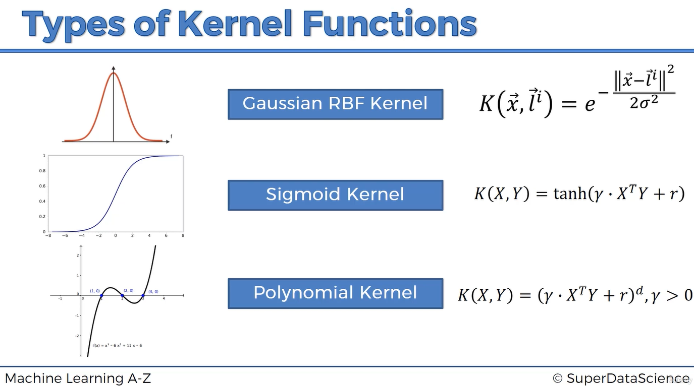

# Types of Kernel Functions

The Radial Basis Function (RBF), also called the Gaussian kernel, is one of the most widely used kernels for Support Vector Machines. It is not, however, the only available choice.

Different kernels define different measures of similarity between observations. By replacing the ordinary dot product with a kernel function, an SVM can learn a linear maximum-margin separator in an implicit feature space. That separator may correspond to a non-linear boundary in the original input space.

Common choices include:

- the linear kernel;
- the Gaussian RBF kernel;
- the polynomial kernel; and
- the sigmoid kernel.

The graphs in this overview illustrate the general shapes associated with the functions. A kernel value itself measures similarity between a pair of feature vectors; it is not, by itself, the final classification boundary.

## What a Kernel Function Does

A kernel is a function of two observations:

\[
K(x,z).
\]

For a valid kernel, this value corresponds to an inner product in some feature space:

\[
K(x,z)=\phi(x)^T\phi(z),
\]

where \(\phi\) is an explicit or implicit feature mapping.

The trained SVM combines kernel evaluations in its decision function:

\[
f(x)
=
\sum_{i\in SV}\alpha_i y_iK(x_i,x)+b.
\]

The prediction depends on the sign of \(f(x)\), not on a single kernel value:

\[
\hat y=\operatorname{sign}(f(x)).
\]

Choosing a kernel therefore determines how the SVM compares observations and what types of boundaries it can represent.

## Linear Kernel

The linear kernel is the ordinary dot product:

\[
K(x,z)=x^Tz.
\]

It does not introduce a non-linear feature mapping. The resulting decision boundary is a linear hyperplane in the original feature space:

\[
w^Tx+b=0.
\]

### When It Is Useful

The linear kernel is a good choice when:

- the classes are approximately linearly separable;
- the number of features is very large;
- the data is sparse, as in many text-classification problems;
- training speed and interpretability are priorities; or
- a simple baseline is required before trying more flexible kernels.

### Main Parameter

The principal SVM parameter is \(C\), which controls the penalty for margin violations.

The linear kernel does not use \(\gamma\), degree, or `coef0`.

## Gaussian RBF Kernel

The Gaussian RBF kernel is:

\[
K(x,z)
=
\exp\left(-\gamma\lVert x-z\rVert^2\right).
\]

An equivalent form uses \(\sigma\):

\[
K(x,z)
=
\exp\left(
-\frac{\lVert x-z\rVert^2}{2\sigma^2}
\right),
\qquad
\gamma=\frac{1}{2\sigma^2}.
\]

The RBF kernel measures similarity according to distance:

- identical observations have a kernel value of \(1\);
- nearby observations have values close to \(1\); and
- the value approaches \(0\) as the distance increases.

Unlike a directional function, the RBF kernel is radially symmetric. Its value depends on distance from its center, not on direction.

### When It Is Useful

The RBF kernel is a strong general-purpose choice when:

- the class boundary is expected to be non-linear;
- there is no clear reason to prefer a specific polynomial structure;
- the dataset is small or medium-sized; and
- features can be scaled consistently.

### Main Parameters

- \(C\) controls the penalty for margin violations.
- \(\gamma\) controls how local each observation's influence is.

A large \(\gamma\) produces narrow, local influence and can lead to an intricate boundary. A small \(\gamma\) produces broad influence and a smoother boundary.

## Polynomial Kernel

The polynomial kernel is commonly written as:

\[
K(x,z)
=
(\gamma x^Tz+r)^d,
\]

or, using software-oriented notation:

\[
K(x,z)
=
(\gamma x^Tz+\text{coef0})^{\text{degree}}.
\]

The polynomial kernel allows the model to represent interactions among input features. For example, a degree-two mapping can implicitly include squared terms and pairwise products.

For two original features, a quadratic representation may involve terms such as:

\[
x_1^2,\quad x_1x_2,\quad x_2^2.
\]

The kernel calculates the required inner product without necessarily constructing every polynomial feature explicitly.

### When It Is Useful

The polynomial kernel can be useful when:

- interactions of a known degree are plausible;
- the expected decision boundary has polynomial structure; or
- domain knowledge suggests that combinations of features matter.

### Main Parameters

- \(d\), or `degree`, controls the polynomial degree.
- \(\gamma\) scales the dot-product term.
- \(r\), or `coef0`, controls the influence of higher-order versus lower-order terms.
- \(C\) controls the penalty for margin violations.

Higher degrees increase flexibility but can also increase sensitivity to scale, numerical instability, and overfitting.

## Sigmoid Kernel

The sigmoid kernel is:

\[
K(x,z)
=
\tanh(\gamma x^Tz+r).
\]

It resembles the hyperbolic-tangent activation function historically used in neural networks.

The sigmoid kernel is based on a scaled dot product between two vectors. It is not simply a distance-from-a-landmark function, and its S-shaped graph should not be interpreted as automatically assigning everything to one side of a fixed coordinate threshold to one class.

As with other kernels, classification depends on the weighted combination:

\[
f(x)
=
\sum_{i\in SV}\alpha_i y_i
\tanh(\gamma x_i^Tx+r)+b.
\]

### When It Is Useful

The sigmoid kernel may be explored when its neural-network-like similarity is appropriate, but it is selected less often than the linear and RBF kernels in typical SVM applications.

### Main Parameters

- \(\gamma\) scales the dot product.
- \(r\), or `coef0`, shifts the sigmoid.
- \(C\) controls the penalty for margin violations.

An additional caution is that the sigmoid function is not a positive-semidefinite kernel for every possible combination of parameter values. Its parameters require careful selection, and implementations may still solve the resulting optimization problem even when the kernel matrix is not ideal.

## Comparing the Main Kernels

| Kernel | Formula | Boundary flexibility | Important parameters | Typical use |
|---|---|---|---|---|
| **Linear** | \(x^Tz\) | Linear | \(C\) | High-dimensional or approximately linear data |
| **RBF** | \(e^{-\gamma\lVert x-z\rVert^2}\) | Highly flexible and local | \(C,\gamma\) | General-purpose non-linear classification |
| **Polynomial** | \((\gamma x^Tz+r)^d\) | Global polynomial interactions | \(C,\gamma,r,d\) | Problems with plausible polynomial structure |
| **Sigmoid** | \(\tanh(\gamma x^Tz+r)\) | Non-linear, activation-like | \(C,\gamma,r\) | Less-common, problem-dependent applications |

## Choosing a Kernel

There is no kernel that is best for every dataset. A sensible model-selection process is:

1. Scale the input features when the method depends on distances or dot products.
2. Establish a linear SVM baseline.
3. Try the RBF kernel when the linear model underfits and non-linearity is plausible.
4. Try a polynomial kernel when domain knowledge suggests interactions of a particular degree.
5. Consider the sigmoid kernel only when there is a specific motivation and validate it carefully.
6. Tune the kernel and its parameters using cross-validation.
7. Compare performance on an untouched test set.

A more flexible kernel should be retained only when it improves validation performance meaningfully. Training accuracy alone is not sufficient evidence that the kernel generalizes well.

## Valid Kernel Functions

Not every similarity function can safely replace the dot product in an SVM.

For the standard kernel interpretation, a valid kernel should produce a symmetric, positive-semidefinite Gram matrix. For training observations \(x_1,\ldots,x_n\), the Gram matrix is:

\[
G_{ij}=K(x_i,x_j).
\]

Positive semidefiniteness ensures that the kernel corresponds to an inner product in some feature space and preserves the convex structure of the standard SVM optimization problem.

This requirement is often associated with **Mercer's condition**, although the precise mathematical conditions depend on the domain and formulation.

---

# Study Notes

## Core Idea

> A kernel defines how the SVM measures similarity between observations and therefore determines the implicit feature space in which the maximum-margin hyperplane is learned.

The kernel is one component of the classifier. The final prediction comes from a weighted combination of kernel values:

\[
\hat y
=
\operatorname{sign}
\left(
\sum_{i\in SV}\alpha_i y_iK(x_i,x)+b
\right).
\]

## Kernel Formula Summary

### Linear

\[
K(x,z)=x^Tz.
\]

### Gaussian RBF

\[
K(x,z)=\exp(-\gamma\lVert x-z\rVert^2).
\]

### Polynomial

\[
K(x,z)=(\gamma x^Tz+r)^d.
\]

### Sigmoid

\[
K(x,z)=\tanh(\gamma x^Tz+r).
\]

## Parameter Reference

| Parameter | Meaning | Used by |
|---|---|---|
| \(C\) | Penalty for margin violations; larger values prioritize fitting training data | All standard SVM kernels |
| \(\gamma\) | Scale or locality of the kernel | RBF, polynomial, sigmoid |
| \(d\) / `degree` | Polynomial degree | Polynomial |
| \(r\) / `coef0` | Independent constant shifting the polynomial or sigmoid calculation | Polynomial, sigmoid |

## Parameter Effects

### \(C\)

- **Small \(C\):** stronger regularization, wider effective margin, and more tolerance for violations.
- **Large \(C\):** weaker regularization, stronger penalty for violations, and greater risk of overfitting.

### RBF \(\gamma\)

- **Small \(\gamma\):** wide regions of influence and a smoother boundary.
- **Large \(\gamma\):** narrow regions of influence and a more detailed boundary.

### Polynomial Degree

- **Low degree:** simpler, smoother interactions.
- **High degree:** more complex interactions and greater overfitting risk.

### `coef0`

- Controls the balance between lower-order and higher-order terms in a polynomial kernel.
- Shifts the transition region of a sigmoid kernel.
- Its effect should be assessed together with \(\gamma\).

## Local vs. Global Behavior

The RBF and polynomial kernels behave differently:

- The **RBF kernel** is local: similarity decreases with Euclidean distance.
- The **polynomial kernel** is global: changing one observation can affect similarity through dot-product interactions across the space.
- The **sigmoid kernel** transforms dot-product similarity through a saturating non-linearity.
- The **linear kernel** uses global linear similarity without adding non-linearity.

## Feature Scaling

Scaling is important because:

- RBF uses squared Euclidean distances;
- polynomial and sigmoid kernels use dot products; and
- unscaled features with large numeric ranges may dominate both calculations.

The scaler must be fitted only on training data to prevent leakage.

## Common Misconceptions

1. **“RBF is the only Kernel SVM option.”**  
   Linear, polynomial, sigmoid, and custom valid kernels are also possible.

2. **“The sigmoid kernel separates everything to the left from everything to the right.”**  
   Its plotted S-shape describes the transformation of a scalar dot-product value. The full SVM boundary depends on all support-vector contributions.

3. **“A polynomial kernel simply draws the polynomial shown in its graph.”**  
   It calculates pairwise similarity through a polynomial of the dot product. The resulting decision boundary depends on the trained SVM coefficients.

4. **“A more complex kernel is automatically more accurate.”**  
   Greater flexibility can improve fit or cause overfitting. Performance must be assessed through validation.

5. **“Any similarity function can be used as a kernel.”**  
   Standard Kernel SVM theory requires a valid kernel, usually characterized by a symmetric positive-semidefinite Gram matrix.

## Practical Selection Guide

| Situation | Good starting point |
|---|---|
| Many sparse features, such as document vectors | Linear |
| No clear structure and a non-linear boundary is likely | RBF |
| Known feature interactions of a limited degree | Polynomial |
| Specific reason to model saturating dot-product similarity | Sigmoid |
| Very large dataset | Linear or a scalable approximation before a full Kernel SVM |

These are starting points rather than guarantees. Cross-validation should guide the final choice.

## Quick Review Questions

1. What role does a kernel play in an SVM?
2. How does the linear kernel differ from the other kernels?
3. What does the RBF kernel use to measure similarity?
4. What behavior does \(\gamma\) control in an RBF kernel?
5. What kinds of relationships can a polynomial kernel represent?
6. What do `degree` and `coef0` control?
7. Why is the sigmoid graph not itself an SVM decision boundary?
8. Why is the sigmoid kernel less straightforward than the RBF kernel?
9. Why should features be scaled before applying these kernels?
10. Why should a linear baseline be evaluated before a more complex kernel?
11. What is a kernel Gram matrix?
12. Why does positive semidefiniteness matter?

## One-Sentence Summary

Linear, RBF, polynomial, and sigmoid kernels give an SVM different notions of similarity and different levels of boundary flexibility, so the kernel and its parameters should be selected through scaling, cross-validation, and comparison with a simple baseline.
