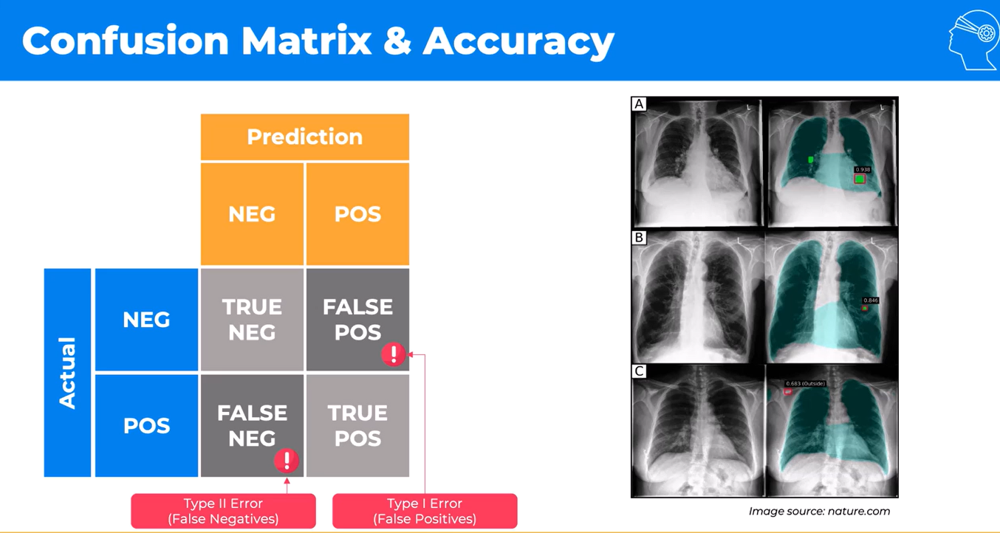
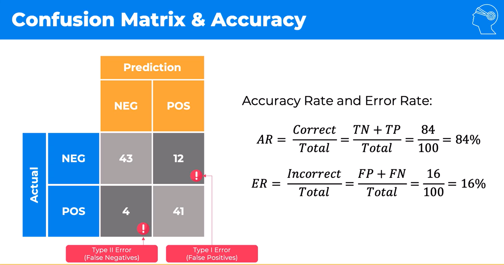
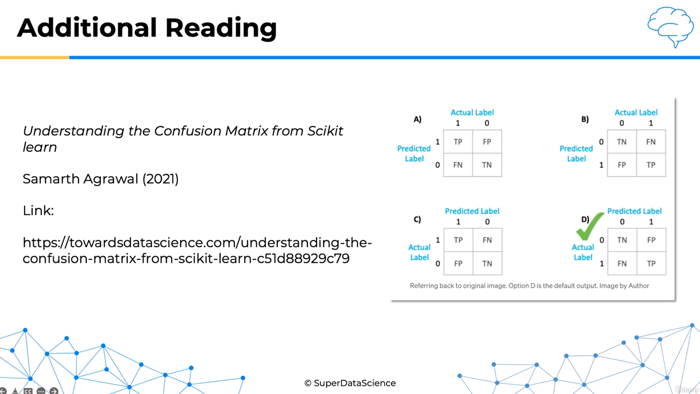

# Confusion Matrix and Classification Metrics

Today, we are going to examine the **confusion matrix** and the performance metrics that can be calculated from it.

## The Cancer-Detection Example

Imagine that we are building a model that examines lung X-ray images and predicts whether a patient has cancer.

The model can make one of two predictions:

- **Negative:** The model predicts that the patient does not have cancer.
- **Positive:** The model predicts that the patient has cancer.

The patient's actual condition can also be negative or positive. By comparing the predicted class with the actual class, we obtain four possible outcomes.

In the convention used here, the rows represent the **actual class** and the columns represent the **predicted class**:

| Actual \ Predicted | Negative | Positive |
|---|---:|---:|
| **Negative** | True Negative (TN) | False Positive (FP) |
| **Positive** | False Negative (FN) | True Positive (TP) |



> Confusion matrices are not always displayed in this orientation. Some sources and software tools reverse the axes or the order of the classes. Always read the axis labels before interpreting the cells.

## The Four Possible Outcomes

### True Negative (TN)

The model predicts **negative**, and the patient does not have cancer. The prediction is correct.

### True Positive (TP)

The model predicts **positive**, and the patient does have cancer. Although the diagnosis is difficult for the patient, the model has correctly detected the condition, allowing the patient and doctor to consider appropriate follow-up and treatment.

### False Positive (FP): Type I Error

The model predicts that the patient has cancer when the patient does not. This incorrect positive result may cause unnecessary anxiety, further tests, expense, and possibly unnecessary intervention.

### False Negative (FN): Type II Error

The model predicts that the patient does not have cancer when the patient actually does. In this context, a false negative can be especially dangerous because diagnosis and treatment may be delayed while the disease progresses.

Both kinds of error matter, but their consequences are not necessarily equal. In medical screening, reducing false negatives is often a high priority, although the appropriate balance depends on the clinical setting and must be determined by qualified medical professionals.

## Numerical Example

Suppose the model is evaluated on 100 patients and produces the following results:

| Actual \ Predicted | Negative | Positive | Total |
|---|---:|---:|---:|
| **Negative** | TN = 43 | FP = 12 | 55 |
| **Positive** | FN = 4 | TP = 41 | 45 |
| **Total** | 47 | 53 | 100 |



The model made:

- `43 + 41 = 84` correct predictions
- `12 + 4 = 16` incorrect predictions

### Accuracy Rate

Accuracy is the proportion of all predictions that were correct:

$$
\text{Accuracy}
= \frac{TP + TN}{TP + TN + FP + FN}
= \frac{41 + 43}{100}
= 0.84
= 84\%
$$

### Error Rate

The error rate is the proportion of all predictions that were incorrect:

$$
\text{Error Rate}
= \frac{FP + FN}{TP + TN + FP + FN}
= \frac{12 + 4}{100}
= 0.16
= 16\%
$$

Accuracy and error rate are complements:

$$
\text{Error Rate} = 1 - \text{Accuracy}
$$

The confusion matrix therefore provides more information than accuracy alone: it shows not only how often the model is wrong, but also **how** it is wrong.

## Additional Reading

The course recommends **“Understanding the Confusion Matrix from Scikit-learn”** by Samarth Agrawal (2021). It illustrates the different layouts used for confusion matrices and reinforces the importance of checking the actual and predicted axes.



---

# Study Notes

## Core Vocabulary

- **Positive class:** The condition the model is intended to detect; cancer in this example.
- **Negative class:** The absence of that condition.
- **True:** The prediction agrees with the actual class.
- **False:** The prediction disagrees with the actual class.
- **TP:** Predicted positive and actually positive.
- **TN:** Predicted negative and actually negative.
- **FP:** Predicted positive but actually negative; a Type I error.
- **FN:** Predicted negative but actually positive; a Type II error.

## A Reliable Way to Decode the Terms

Read each term from right to left:

1. **Positive or negative** tells you what the model predicted.
2. **True or false** tells you whether that prediction was correct.

For example, a **false negative** is a negative prediction that was false.

## Key Formulas

Let:

$$
N = TP + TN + FP + FN
$$

| Metric | Formula | Main question answered |
|---|---|---|
| **Accuracy** | $\frac{TP+TN}{N}$ | How often is the model correct overall? |
| **Error rate** | $\frac{FP+FN}{N}$ | How often is the model wrong overall? |
| **Precision** | $\frac{TP}{TP+FP}$ | Of the positive predictions, how many were correct? |
| **Recall / Sensitivity** | $\frac{TP}{TP+FN}$ | Of the actual positives, how many were detected? |
| **Specificity** | $\frac{TN}{TN+FP}$ | Of the actual negatives, how many were rejected correctly? |
| **False-positive rate** | $\frac{FP}{FP+TN}$ | Of the actual negatives, how many were incorrectly flagged? |
| **False-negative rate** | $\frac{FN}{FN+TP}$ | Of the actual positives, how many were missed? |
| **F1 score** | $\frac{2TP}{2TP+FP+FN}$ | How well are precision and recall balanced? |

## Metrics for This Example

Using `TN = 43`, `FP = 12`, `FN = 4`, and `TP = 41`:

| Metric | Calculation | Result |
|---|---:|---:|
| Accuracy | `(41 + 43) / 100` | **84.00%** |
| Error rate | `(12 + 4) / 100` | **16.00%** |
| Precision | `41 / (41 + 12)` | **77.36%** |
| Recall / Sensitivity | `41 / (41 + 4)` | **91.11%** |
| Specificity | `43 / (43 + 12)` | **78.18%** |
| False-positive rate | `12 / (12 + 43)` | **21.82%** |
| False-negative rate | `4 / (4 + 41)` | **8.89%** |
| F1 score | `82 / (82 + 12 + 4)` | **83.67%** |

## Precision vs. Recall

- Prioritize **precision** when false positives are especially costly. High precision means that a positive prediction is usually correct.
- Prioritize **recall** when false negatives are especially costly. High recall means that the model detects most of the actual positive cases.

There is often a trade-off between precision and recall. Lowering a classifier's decision threshold may detect more positive cases and improve recall, but it can also create more false positives and reduce precision.

## Why Accuracy Can Be Misleading

Accuracy may conceal poor performance when the classes are imbalanced. For example, if only 1% of patients have a condition, a model that always predicts “negative” would be 99% accurate but would miss every positive patient.

For an imbalanced problem, inspect the confusion matrix and consider precision, recall, specificity, F1 score, and metrics such as balanced accuracy or the precision–recall curve.

## Software Orientation Check

Before reading any confusion matrix:

1. Identify which axis contains the actual labels.
2. Identify which axis contains the predicted labels.
3. Check the order of the negative and positive classes.
4. Map the four cells to TN, FP, FN, and TP.
5. Only then calculate or interpret the metrics.

For the layout used in this lesson:

```text
                 Predicted
               Negative  Positive
Actual Negative    TN        FP
       Positive    FN        TP
```

## Exam-Style Summary

A confusion matrix compares a classifier's predicted classes with the actual classes. In binary classification, it contains true positives, true negatives, false positives, and false negatives. Accuracy measures the overall proportion of correct predictions, while the error rate measures the proportion of incorrect predictions. Precision focuses on the reliability of positive predictions, recall measures how many actual positives were detected, and specificity measures how many actual negatives were identified correctly. The choice of metric should reflect the real-world consequences of each kind of error.

## Quick Review Questions

1. What makes a prediction “true” or “false”?
2. What is the difference between a false positive and a false negative?
3. Which error is also called a Type I error?
4. How are accuracy and error rate related?
5. Why can accuracy be misleading for imbalanced data?
6. When would recall be more important than precision?
7. Why must you inspect the axes before interpreting a confusion matrix?
