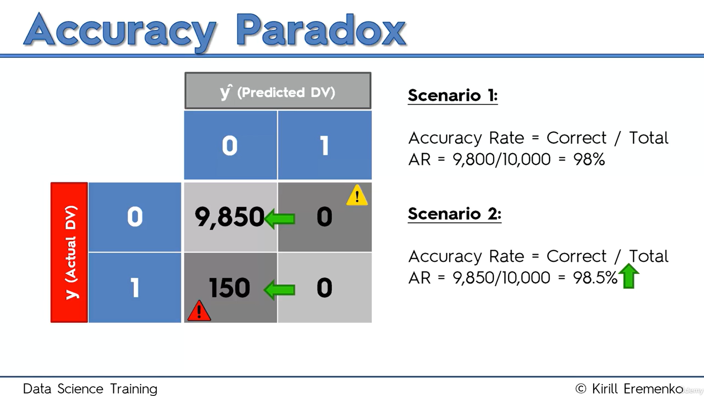

# The Accuracy Paradox

Consider a binary classifier evaluated on 10,000 observations. The positive class is rare: only 150 observations are actually positive, while 9,850 are negative.

## Scenario 1: Using the Classification Model

The model makes:

- 150 false-positive, or Type I, errors
- 50 false-negative, or Type II, errors
- 9,800 correct predictions

Its confusion matrix is:

| Actual \ Predicted | 0 | 1 | Total |
|---|---:|---:|---:|
| **0** | TN = 9,700 | FP = 150 | 9,850 |
| **1** | FN = 50 | TP = 100 | 150 |
| **Total** | 9,750 | 250 | 10,000 |

The model's accuracy is:

$$
\text{Accuracy}
= \frac{TP + TN}{TP + TN + FP + FN}
= \frac{100 + 9{,}700}{10{,}000}
= \frac{9{,}800}{10{,}000}
= 98\%
$$

The original transcript describes this result as 90%, but the correct value is **98%**.

## Scenario 2: Always Predicting Zero

Now suppose we abandon the model and predict `0`—the negative class—for every observation.

Every prediction that was previously in the predicted-positive column moves into the predicted-negative column:

| Actual \ Predicted | 0 | 1 | Total |
|---|---:|---:|---:|
| **0** | TN = 9,850 | FP = 0 | 9,850 |
| **1** | FN = 150 | TP = 0 | 150 |
| **Total** | 10,000 | 0 | 10,000 |

The accuracy becomes:

$$
\text{Accuracy}
= \frac{TP + TN}{10{,}000}
= \frac{0 + 9{,}850}{10{,}000}
= 98.5\%
$$

Accuracy has increased from 98% to 98.5%—an increase of **0.5 percentage points**—even though the new rule does not detect a single positive observation. Its recall for the positive class is zero:

$$
\text{Recall}
= \frac{TP}{TP + FN}
= \frac{0}{0 + 150}
= 0\%
$$

This misleading result is known as the **accuracy paradox**. When one class is much more common than the other, a classifier can achieve high accuracy simply by predicting the majority class every time. A higher accuracy score does not necessarily indicate a more useful model.

For this reason, model evaluation should not rely on accuracy alone. The confusion matrix and metrics such as precision, recall, specificity, F1 score, balanced accuracy, and area under an appropriate evaluation curve provide a more complete picture. The next lesson introduces the **Cumulative Accuracy Profile (CAP)** as another way to assess a model's ability to identify high-value positive cases.

---

# Study Notes

## Key Idea

> Accuracy asks how many predictions were correct, but it does not show which classes the model predicted correctly.

This distinction becomes especially important when the classes are imbalanced.

## Class Distribution

In this example:

$$
\text{Negative prevalence}
= \frac{9{,}850}{10{,}000}
= 98.5\%
$$

$$
\text{Positive prevalence}
= \frac{150}{10{,}000}
= 1.5\%
$$

Because 98.5% of the observations belong to class `0`, always predicting `0` automatically produces 98.5% accuracy.

## Model vs. Majority-Class Baseline

| Metric | Scenario 1: Model | Scenario 2: Always `0` |
|---|---:|---:|
| Accuracy | 98.0% | **98.5%** |
| Precision | **40.0%** | Undefined |
| Recall / Sensitivity | **66.67%** | 0.0% |
| Specificity | 98.48% | **100.0%** |
| F1 score | **50.0%** | 0.0% |
| Balanced accuracy | **82.57%** | 50.0% |
| Positive cases detected | **100 of 150** | 0 of 150 |

Although the trivial rule has greater accuracy and specificity, the original model is far better at detecting positive cases.

### Supporting Calculations for Scenario 1

$$
\text{Precision}
= \frac{TP}{TP + FP}
= \frac{100}{100 + 150}
= 40\%
$$

$$
\text{Recall}
= \frac{TP}{TP + FN}
= \frac{100}{100 + 50}
\approx 66.67\%
$$

$$
\text{Specificity}
= \frac{TN}{TN + FP}
= \frac{9{,}700}{9{,}700 + 150}
\approx 98.48\%
$$

$$
\text{F1}
= \frac{2TP}{2TP + FP + FN}
= \frac{200}{200 + 150 + 50}
= 50\%
$$

## Accuracy vs. Percentage-Point Change

The accuracy rises from 98% to 98.5%.

- **Absolute increase:** `98.5% − 98% = 0.5 percentage points`
- **Relative increase:** `(98.5 − 98) / 98 ≈ 0.51%`

“Percent” and “percentage points” are not interchangeable when comparing two rates.

## Majority-Class Baseline

A **baseline** is a simple reference method that a useful model should be compared against. For imbalanced binary data, a common baseline always predicts the majority class.

The baseline is not necessarily a deployable solution. It provides context:

- If a model cannot outperform or otherwise improve meaningfully on a simple baseline, its practical value is questionable.
- “Outperform” should be judged using metrics aligned with the real objective, not necessarily accuracy.

In this example, the model loses to the baseline on accuracy but wins decisively on positive-class recall and F1 score.

## Metrics for Imbalanced Classification

| Metric | What it emphasizes |
|---|---|
| **Precision** | Reliability of positive predictions |
| **Recall / Sensitivity** | Proportion of actual positives detected |
| **Specificity** | Proportion of actual negatives identified correctly |
| **F1 score** | Balance between precision and recall |
| **Balanced accuracy** | Average of recall and specificity |
| **Precision–recall curve** | Threshold trade-off when the positive class is rare |
| **ROC curve / ROC AUC** | Trade-off between true-positive and false-positive rates |
| **CAP curve** | How effectively ranked predictions concentrate positive cases |

No single metric is best for every problem. Choose metrics based on class imbalance, error costs, probability quality, and the real-world objective.

## Balanced Accuracy

Balanced accuracy gives equal importance to the positive and negative classes:

$$
\text{Balanced Accuracy}
= \frac{\text{Sensitivity} + \text{Specificity}}{2}
$$

For the original model:

$$
\frac{66.67\% + 98.48\%}{2}
\approx 82.57\%
$$

For the always-negative rule:

$$
\frac{0\% + 100\%}{2}
= 50\%
$$

This exposes the weakness that ordinary accuracy hides.

## Practical Evaluation Checklist

1. Examine the distribution of the target classes.
2. Establish a simple baseline.
3. Inspect the complete confusion matrix.
4. Identify the real costs of false positives and false negatives.
5. Select metrics that reflect those costs.
6. Evaluate performance on unseen validation or test data.
7. Compare models at decision thresholds appropriate to the application.

## Exam-Style Summary

The accuracy paradox occurs when a simplistic classifier achieves high—or even improved—accuracy while becoming less useful. It is common in imbalanced datasets because predicting only the majority class can classify most observations correctly while completely ignoring the minority class. Therefore, accuracy should be interpreted alongside the confusion matrix, class distribution, a suitable baseline, and metrics such as precision, recall, F1 score, specificity, or balanced accuracy.

## Quick Review Questions

1. What is the accuracy paradox?
2. Why does always predicting class `0` produce 98.5% accuracy in this example?
3. How many positive cases does the always-negative rule detect?
4. Why is the original model more useful despite its lower accuracy?
5. What is the difference between a percentage and a percentage-point change?
6. What does balanced accuracy reveal in this example?
7. Which metrics would you examine when the positive class is rare?
