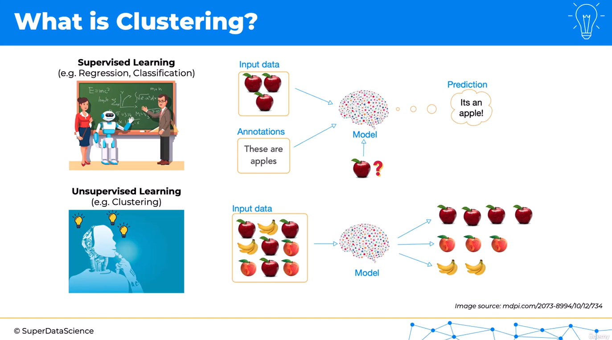
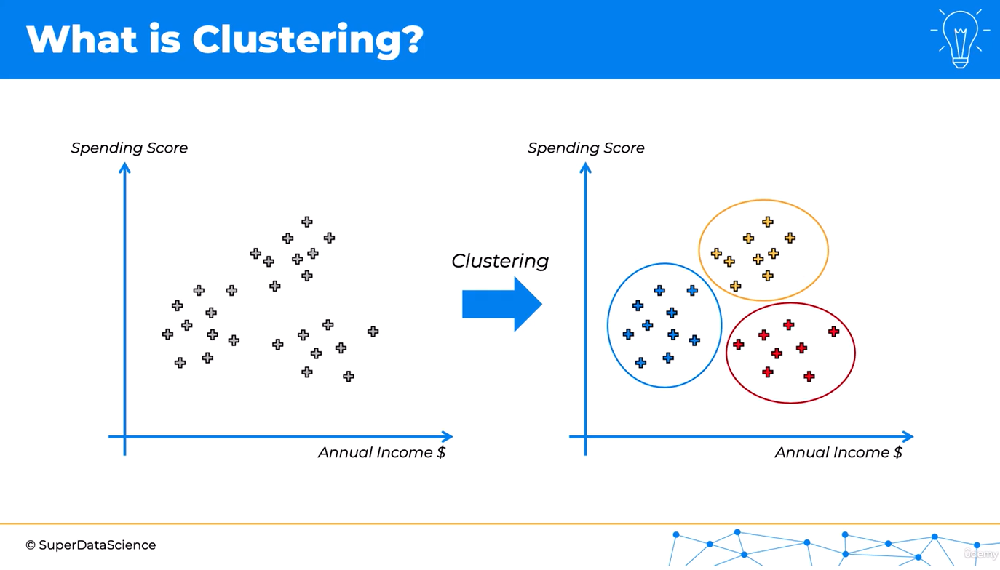

# Introduction to Clustering

Clustering is our first encounter with **unsupervised machine learning**. It is the process of grouping unlabeled data points according to similarities and differences in their features.

## Supervised Learning vs. Unsupervised Learning

So far, we have worked mainly with supervised learning algorithms, including regression and classification. In supervised learning, the training data contains both the input features and the correct answers, known as **labels** or **targets**.

Consider an image-classification problem. We might provide a model with several pictures of apples, each labeled “apple.” The model learns the relationship between the images and their labels. When it receives a new image, it can use what it has learned to predict that the image contains an apple.

Unsupervised learning is different because the training data has no labels. The model is given only the input data and must identify useful structure within it.

For example, suppose we provide a model with unlabeled images of apples, bananas, and peaches. The model does not know the names of these fruits. However, it can compare features such as shape, colour, and texture, then place similar images into groups. It may separate the images successfully without understanding the human concepts of “apple,” “banana,” or “peach.”

In short:

- **Supervised learning** learns from input data paired with known answers.
- **Unsupervised learning** explores unlabeled data to discover patterns or structure.
- **Clustering** is an unsupervised learning task that organizes similar observations into groups.

## Business Example: Customer Segmentation

Imagine a store with customer data containing two features:

- **Annual income** — how much each customer earns.
- **Spending score** — a combined measure of the customer's purchasing frequency, amount spent, and other spending behaviour.

When the customers are plotted using these two features, natural groupings may appear. However, the business has no predefined customer categories or class labels. A clustering algorithm can analyze the points and suggest groups of customers with similar income and spending patterns.

After the clusters have been identified, the business can investigate what each group represents. It might then use the results to:

- design targeted promotions;
- recommend relevant products;
- create group-specific offers and reminders;
- improve customer service;
- identify high-value or underserved customer segments; and
- allocate marketing resources more effectively.

Clustering is therefore an exploratory technique. It helps reveal patterns that may not be obvious in raw data, but a person with domain knowledge must still interpret the resulting groups and decide whether they are useful.

---

# Study Notes

## Core Definition

> **Clustering is the task of dividing unlabeled observations into groups so that observations within the same group are more similar to one another than to observations in other groups.**

Each resulting group is called a **cluster**.

## Key Terminology

| Term | Meaning |
|---|---|
| Observation / data point | One item or record in the dataset, such as one customer |
| Feature | A measurable property, such as annual income or spending score |
| Label / target | A known answer supplied during supervised learning |
| Unlabeled data | Data that contains features but no known target |
| Cluster | A group of observations judged to be similar |
| Segmentation | Dividing a larger population into meaningful groups |

## Quick Comparison

| Aspect | Supervised Learning | Unsupervised Learning |
|---|---|---|
| Training labels | Available | Not available |
| Main objective | Predict a known target | Discover hidden structure |
| Common tasks | Regression and classification | Clustering and dimensionality reduction |
| Example | Predict whether an image contains an apple | Group similar fruit images |
| Evaluation | Compare predictions with known answers | Use internal metrics and domain interpretation |

## How Clustering Works Conceptually

1. Represent every observation using relevant features.
2. Define or imply a measure of similarity or distance.
3. Apply a clustering algorithm to group similar observations.
4. Examine and interpret the resulting clusters.
5. Validate whether the clusters are stable, meaningful, and useful.

## Important Distinctions

- A **classification** model assigns observations to predefined, labeled classes.
- A **clustering** model discovers groups that were not labeled in advance.
- A cluster number is only an identifier. For example, “Cluster 1” has no inherent business meaning until it is interpreted.
- Clustering algorithms detect mathematical structure; they do not understand the data in the human sense.

## Common Applications

- customer and market segmentation;
- grouping similar documents, news articles, or search results;
- organizing images by visual similarity;
- discovering communities in social networks;
- grouping genes or biological samples;
- identifying patterns in user behaviour; and
- supporting anomaly detection by finding points that do not fit well into any cluster.

## Practical Considerations

- **Feature selection matters:** Irrelevant features can hide useful groupings.
- **Feature scaling matters:** A feature with large numerical values may dominate distance calculations.
- **The number of clusters may be unknown:** Some algorithms require it in advance, while others infer it from the data.
- **Different algorithms can produce different groups:** Results depend on the algorithm, distance measure, and parameter choices.
- **Clusters are not automatically meaningful:** A mathematical grouping must be checked against domain knowledge.
- **Correlation is not causation:** A discovered segment does not explain why its members behave similarly.
- **Outliers can affect results:** Extreme observations may distort clusters or form small clusters of their own.

## Customer-Segmentation Interpretation

With annual income on the horizontal axis and spending score on the vertical axis, possible segments might include:

- lower-income customers with moderate spending;
- higher-income customers with high spending; and
- higher-income customers with lower spending.

These names are interpretations made after clustering. The algorithm itself returns groups based on the feature values; it does not assign business descriptions automatically.

## Knowledge Check

1. Why is clustering described as an unsupervised learning task?
2. What is the main difference between clustering and classification?
3. In the customer example, what does one plotted point represent?
4. Why should features usually be scaled before using a distance-based clustering algorithm?
5. Why must a domain expert interpret the clusters?

## Answers

1. Because it discovers patterns in data that has no known target labels.
2. Classification predicts predefined classes, whereas clustering discovers groups from unlabeled data.
3. One customer, represented by that customer's annual income and spending score.
4. Scaling prevents features with larger numerical ranges from dominating the distance calculation.
5. The algorithm finds mathematical groupings, but domain expertise is needed to determine what they mean and whether they are useful.

## One-Minute Recap

- Clustering groups similar, unlabeled observations.
- It is a form of unsupervised learning.
- Unlike classification, it does not begin with predefined classes.
- Customer segmentation is a common business application.
- The output must be interpreted and validated; a cluster is a suggested pattern, not automatically a meaningful truth.
